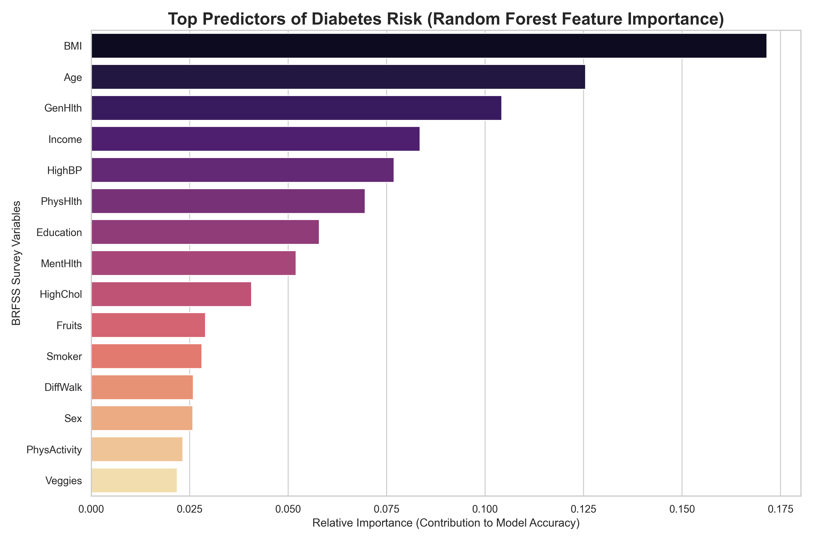
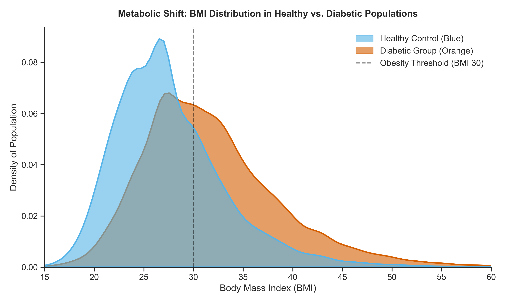
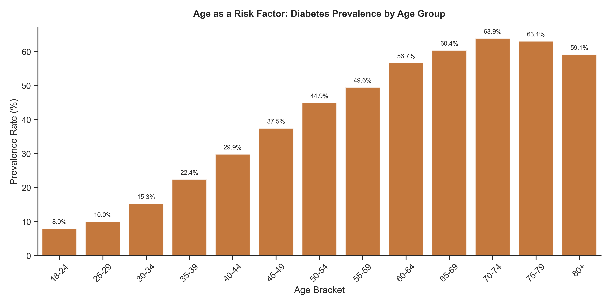
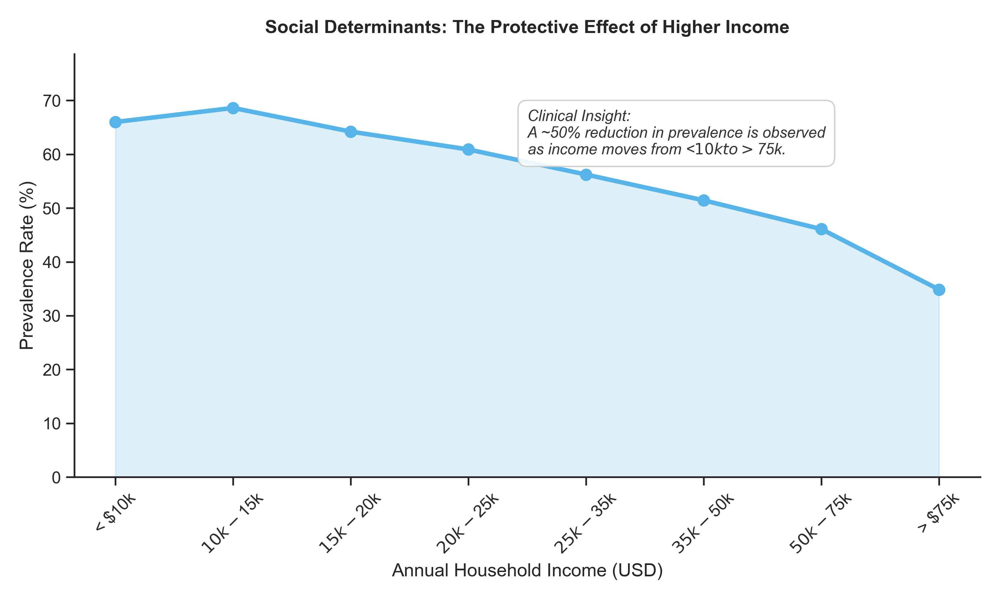
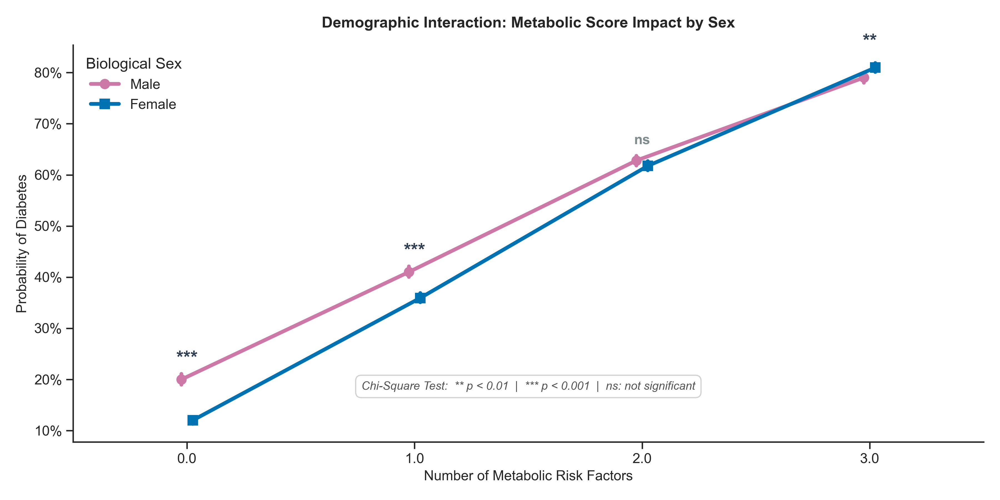
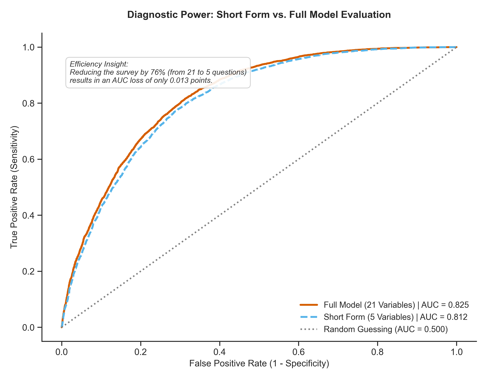

# Diabetes Risk Prediction: A Clinical Data Science Approach


## Executive Summary
This project analyzes the **BRFSS 2015 dataset** (Behavioral Risk Factor Surveillance System) from the CDC, containing health data from ~70,000 individuals. The primary objective is to evaluate whether a subset of survey questions can accurately predict diabetes risk, optimizing the screening process. 

Through exploratory data analysis, feature engineering (Metabolic Syndrome Scoring), and Machine Learning (Random Forest & Logistic Regression), **this project successfully reduced the survey questionnaire by 76% (from 21 questions to just 5) while experiencing a negligible AUC loss of only 0.013 points.**

---

## Methodology & Key Clinical Findings

### 1. Feature Selection: Identifying the Root Causes
While linear correlation highlighted subjective metrics like "Poor General Health" as strong indicators, a **Random Forest Classifier** was deployed to capture non-linear relationships and identify the physiological root causes.

The algorithm identified **Body Mass Index (BMI)** and **Age** as the most critical predictors, filtering the 21-variable dataset down to an optimized "Short Form" of 5 key questions: *BMI, Age, General Health, Income, and High Blood Pressure*.



### 2. Demographic & Social Determinants
Data visualization revealed a stark contrast in physiological distribution and social determinants:
* **The Obesity Threshold:** There is a clear metabolic shift, with the diabetic population density heavily skewed past the clinical obesity threshold (BMI ≥ 30).
* **Socioeconomic Gradient:** The data confirms the protective effect of higher income, showing a ~50% reduction in diabetes prevalence as annual household income moves from <$10k to >$75k.





### 3. Feature Engineering: The Synergistic Risk of Metabolic Syndrome
To deepen the clinical analysis, a **Metabolic Syndrome Score** was engineered by combining three critical variables: Obesity, High Blood Pressure, and High Cholesterol. 

* **Finding:** The presence of all three factors yields a ~80% probability of Diabetes.
* **Statistical Validation:** A Chi-Square test of independence confirmed significant differences between biological sexes at 0, 1, and 3 risk factors ($p < 0.01$). Interestingly, at exactly 2 metabolic risk factors, the risk accelerates significantly for women, nullifying the statistical difference between sexes.



---

## Predictive Modeling: Full vs. Short Form

To answer the core research question, a Logistic Regression model was trained to predict diabetes using the optimized "Short Form" (5 variables) and evaluated against a model using the Full Dataset (21 variables).



### Model Performance Metrics (Short Form):
* **Accuracy:** ~74.5%
* **True Positives (Sensitivity):** Successfully identified over 5,300 at-risk patients in the blind test set.

---

## Conclusions

1. **Can survey questions predict diabetes risk?** Yes. Both the full and reduced models demonstrated robust predictive capabilities without the need for immediate blood work, acting as an effective first-line screening tool.
2. **What are the most predictive risk factors?** The Random Forest model proved that physiological metrics (BMI, Age, High BP) combined with social determinants (Income, Perceived General Health) are the primary drivers of the disease.
3. **Can we create an accurate "Short Form"?** **Absolutely.** The ROC curve analysis demonstrates the clinical and business value of feature selection. By deploying the 5-question Short Form, healthcare providers can reduce data collection friction by 76%, saving time and resources, with an AUC difference of only 1.3%.

---

## How to Run the Project

1. Clone the repository:
   ```bash
   git clone [https://github.com/your-username/diabetes-risk-prediction.git](https://github.com/your-username/diabetes-risk-prediction.git)

2. Create and activate a virtual environment:
    ```bash
    python3 -m venv venv
    source venv/bin/activate  # On Windows use: venv\Scripts\activate

3. Install the required dependencies:
    ```bash
    pip install pandas numpy matplotlib seaborn scikit-learn scipy

4. Run the analysis scripts located in the src/ folder.

## Author: Fabian Rojas Guzmán - Biochemist transitioning into Data Science. Passionate about applying clinical rigor and statistical analysis to uncover actionable insights.
